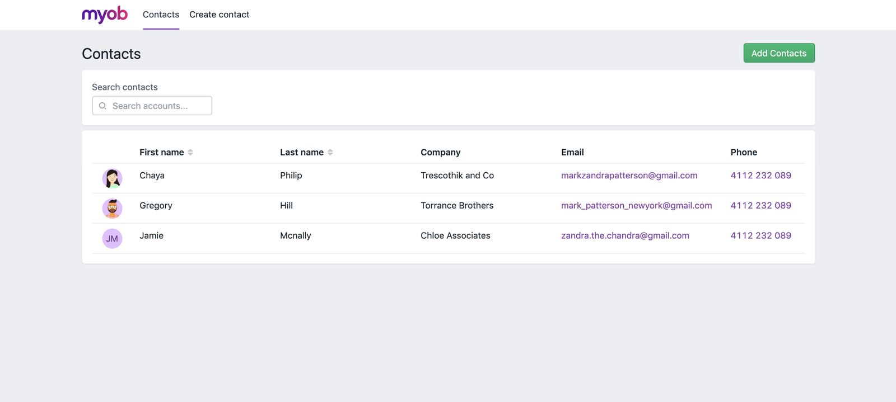
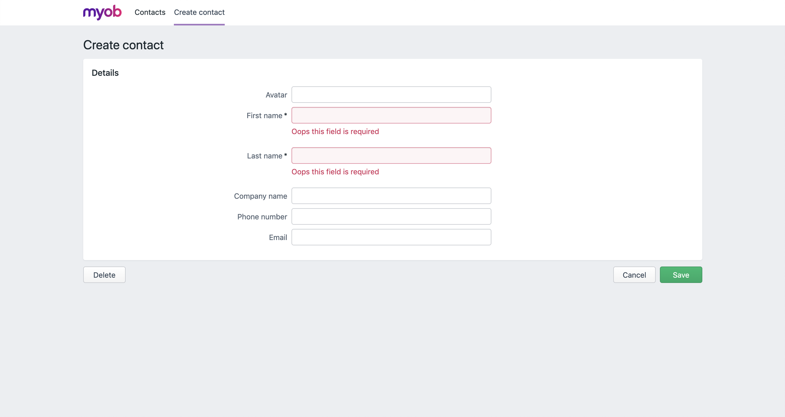
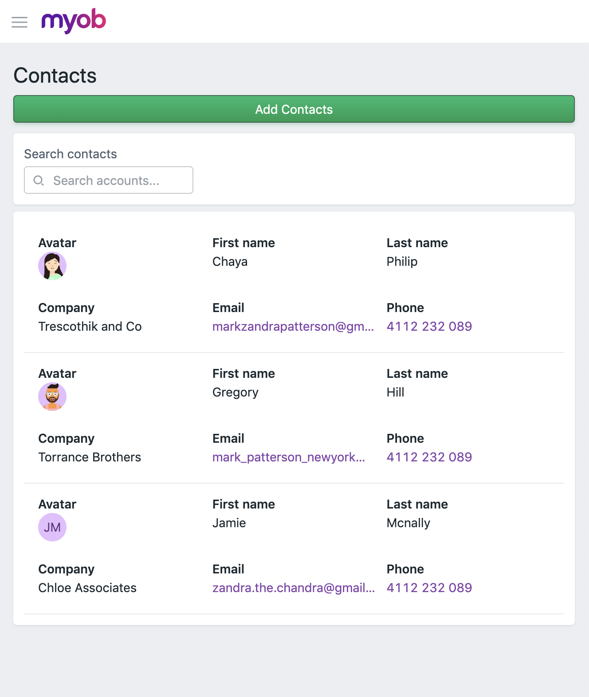
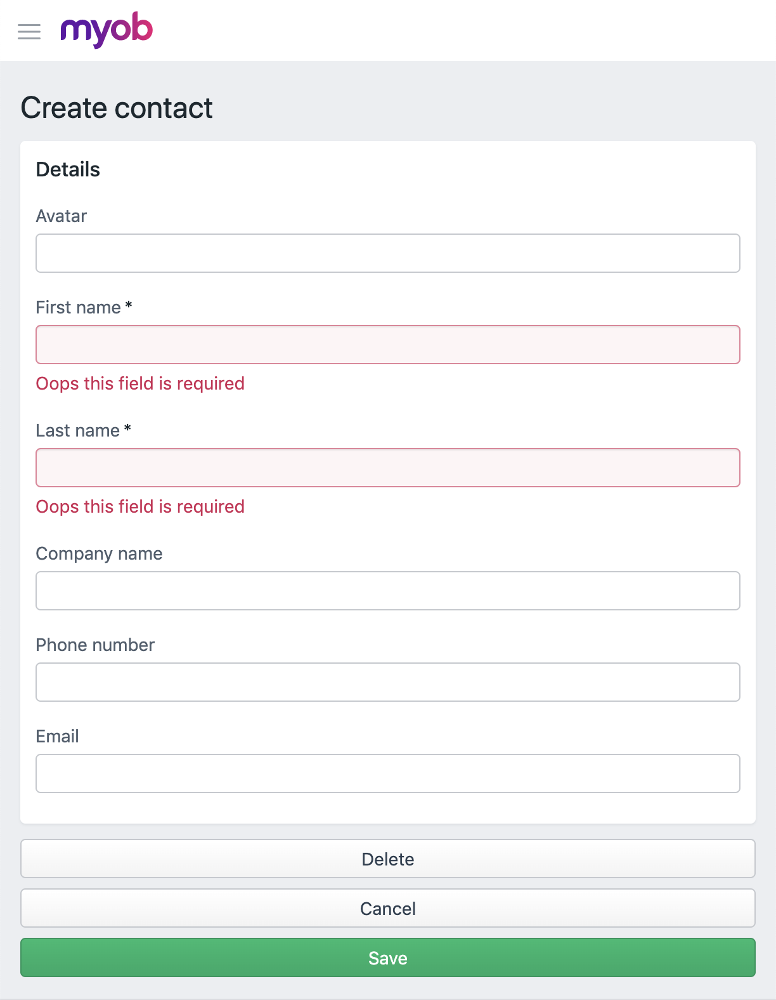

# leah-feelix-project-2

### Description of project

- Project: 'My Contacts"
- This project is created to practice using feelix design system (https://feelix.myob.com/)
-  The project consists of 2 pages:
- - Page One: A list of contacts, and be able to search by contact's first name
- - Page Two: A form to create a new contact
- Mockup for Desktop and Mobiles are shown below:

### Desktop Mock-up

Contacts List Page:

New Contact Page:

### Mobile Mock-up

Contacts List Page:

New Contact Page:

### To start the app
1. clone the repo to your local machine
2. change directory to the repo
3. run app locally:
- `npm install`
- `npm start`

